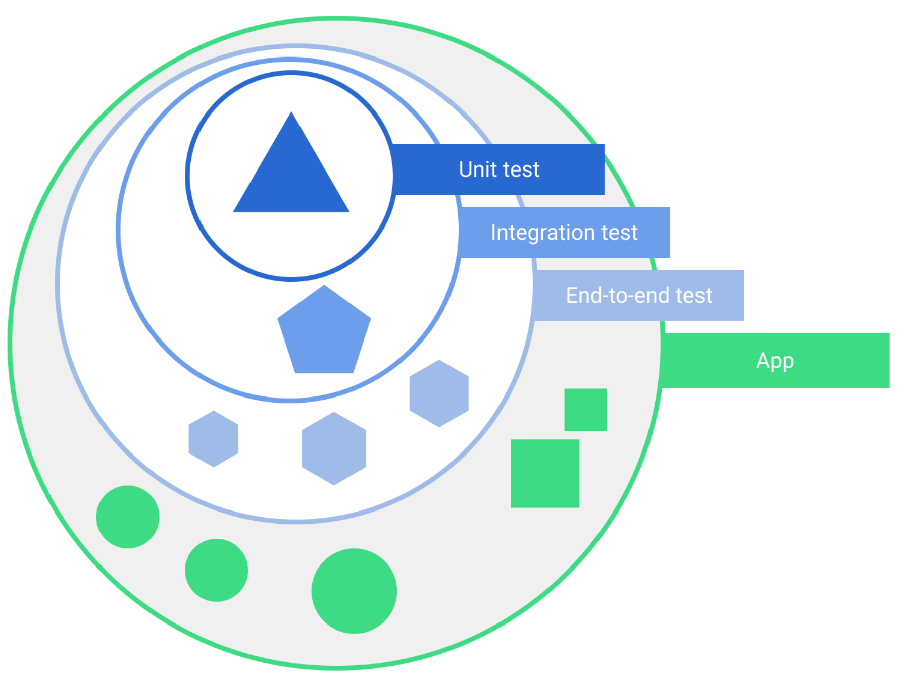

# Software testing

# What
- Software testing is the act of examining the artifacts and the behavior of the software under test by validation and verification.

# Why
- Running tests against your software consistently, you can verify your software's correctness, functional behavior, and usability before you release it publicly.

- Testing also offers the following advantages:
    - Rapid feedback on failures.
    - Early failure detection in the development cycle.
    - Safer code refactoring, allowing you to optimize code without worrying about regressions.
    - Stable development velocity, helping you minimize technical debt.

# How

| Type | How | Props| Cons| Example|
|--|--|--|--|--|
|Manually test | Manually navigating through it ||Time consuming, Human make mistake|use different devices and emulators, change the system language, and try to generate every user error or traverse every user flow.|
|Automated testing| using tools that perform tests| faster, more repeatable, and generally gives you more actionable feedback about your app earlier in the development process.|||

# Types of tests in Mobile applications

## Subject

Example :

- Functional testing: does my app do what it's supposed to?
- Performance testing: does it do it quickly and efficiently?
- Accessibility testing: does it work well with accessibility services?
- Compatibility testing: does it work well on every device and API level?

## Scope
Tests also vary depending on size, or degree of isolation:

- Unit tests or small tests only verify a very small portion of the app, such as a method or class.
- End-to-end tests or big tests verify larger parts of the app at the same time, such as a whole screen or user flow.
- Medium tests are in between and check the integration between two or more units.

# Testable architecture

## Why
- Allows you to easily test different parts of it in isolation.
- Better readability, maintainability, scalability, and reusability.

## How
- Extract part of a function, class, or module from the rest, testing it is easier, and more effective - decoupling, decoupling is the concept most important to testable architecture.
    - Split an app into layers such as Presentation, Domain, and Data. You can also split an app into modules, one per feature.
    - Avoid adding logic to entities that have large dependencies, such as screen. Use these classes as entry points to the framework and move UI and business logic elsewhere, such as to a view, or domain layer.
    - Avoid direct framework dependencies in classes containing business logic.
    - Make dependencies easy to replace - Inversion of control.

https://developer.android.com/training/testing