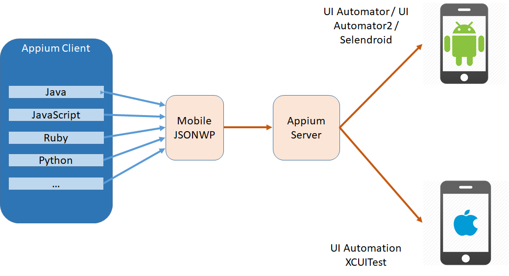

# Appium

# What
Appium is an open source test automation framework for use with native, hybrid and mobile web apps.
It drives iOS, Android, and Windows apps using the WebDriver protocol.



# Appium Design

 - You shouldn't have to recompile your app or modify it in any way in order to automate it. by using vendor-provided automation frameworks under the hood.

- You shouldn't be locked into a specific language or framework to write and run your tests. The client-server architecture, a client written in any language can be used to send the appropriate HTTP requests to the server. Appium speaks the same protocol as Selenium, called the WebDriver Protocol.


- A mobile automation framework shouldn't reinvent the wheel when it comes to automation APIs. Appium extended the WebDriver protocol with extra API methods useful for mobile automation.

- Appium - A mobile automation framework should be open source, in spirit and practice as well as in name!

# Appium Concepts
- Client/Server Architecture: Appium is at its heart a webserver that exposes a REST API. It receives connections from a client, listens for commands, executes those commands on a mobile device, and responds with an HTTP response representing the result of the command execution.

- Session: Automation is always performed in the context of a session. Clients initiate a session with a server and end up sending a POST /session request to the server, with a JSON object called the 'desired capabilities' object. At this point the server will start up the automation session and respond with a session ID which is used for sending further commands.

- Desired Capabilities
Desired capabilities are a set of keys and values (i.e., a map or hash) sent to the Appium server to tell the server what kind of automation session we're interested in starting up. 

- Appium Server
Appium is a server written in Node.js. It can be built and installed from source or installed directly from NPM:

```
$ npm install -g appium
$ appium
```

- Appium Clients
There are client libraries (in Java, Ruby, Python, PHP, JavaScript, and C#) which support Appium's extensions to the WebDriver protocol. When using Appium, you want to use these client libraries instead of your regular WebDriver client. You can view the full list of libraries here.

- Appium Desktop
There is a GUI wrapper around the Appium server that can be downloaded for any platform. It comes bundled with everything required to run the Appium server, so you don't need to worry about Node. It also comes with an Inspector, which enables you to check out the hierarchy of your app. This can come in handy when writing tests.


https://appium.io/
