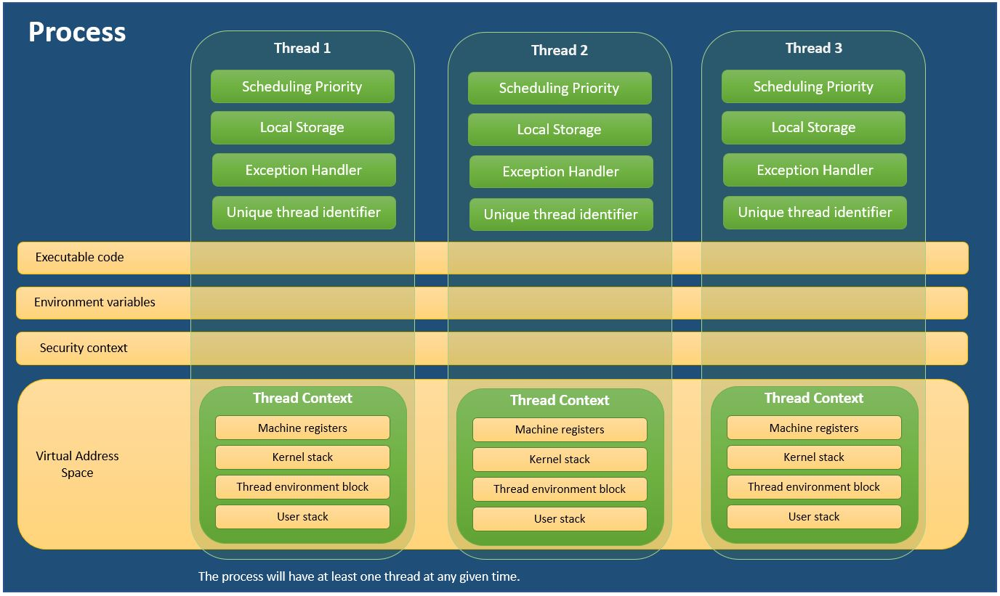

 
 # Process and thread

## What

https://docs.microsoft.com/en-gb/windows/win32/procthread/about-processes-and-threads?redirectedfrom=MSDN

 Each process provides the resources needed to execute a program. A process has a virtual address space, executable code, open handles to system objects, a security context, a unique process identifier, environment variables, a priority class, minimum and maximum working set sizes, and at least one thread of execution. Each process is started with a single thread, often called the primary thread, but can create additional threads from any of its threads.

A thread is the entity within a process that can be scheduled for execution. All threads of a process share its virtual address space and system resources. In addition, each thread maintains exception handlers, a scheduling priority, thread local storage, a unique thread identifier, and a set of structures the system will use to save the thread context until it is scheduled. The thread context includes the thread's set of machine registers, the kernel stack, a thread environment block, and a user stack in the address space of the thread's process. Threads can also have their own security context, which can be used for impersonating clients.
 
# Why
- We use Threads to make applications faster by doing multiple things at the same time.
- In technical terms, Thread helps us to achieve parallelism in programs. Since the CPU is high-speed and it even contains multiple cores, just one Thread cannot take advantage of all the cores.

 # Docs

  [Thread | Apple Developer Documentation](https://developer.apple.com/documentation/foundation/thread)

 [Concurrent Programming With GCD in Swift 3 - WWDC16 - Videos - Apple Developer](https://developer.apple.com/videos/play/wwdc2016/720/)

 [Swift concurrency: Behind the scenes - WWDC21 - Videos - Apple Developer](https://developer.apple.com/videos/play/wwdc2021/10254)

 [Meet async/await in Swift - WWDC21 - Videos - Apple Developer](https://developer.apple.com/videos/play/wwdc2021/10132)

 [Explore structured concurrency in Swift - WWDC21 - Videos - Apple Developer](https://developer.apple.com/videos/play/wwdc2021/10134)

 [swift-evolution/0317-async-let.md at main · apple/swift-evolution](https://github.com/apple/swift-evolution/blob/main/proposals/0317-async-let.md)

 [swift-evolution/0304-structured-concurrency.md at main · apple/swift-evolution](https://github.com/apple/swift-evolution/blob/main/proposals/0304-structured-concurrency.md)

 [swift-evolution/0296-async-await.md at main · apple/swift-evolution](https://github.com/apple/swift-evolution/blob/main/proposals/0296-async-await.md)

 [swift-evolution/0297-concurrency-objc.md at main · apple/swift-evolution](https://github.com/apple/swift-evolution/blob/main/proposals/0297-concurrency-objc.md)

 [Concurrency — The Swift Programming Language (Swift 5.6)](https://docs.swift.org/swift-book/LanguageGuide/Concurrency.html)

 [Swift concurrency: Update a sample app - WWDC21 - Videos - Apple Developer](https://developer.apple.com/videos/play/wwdc2021/10194)

 [Updating an App to Use Swift Concurrency | Apple Developer Documentation](https://developer.apple.com/documentation/swift/swift_standard_library/concurrency/updating_an_app_to_use_swift_concurrency)