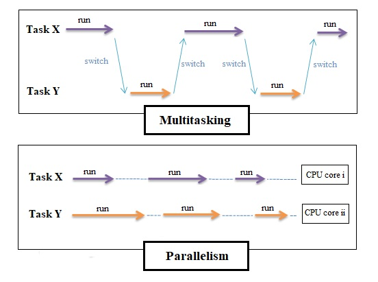

# Concurrent and parallelism Programming

## What


- Concurrent and Multitasking

    In computer science, concurrency is the ability of different parts or units of a program, algorithm, or problem to be executed out-of-order or in partial order, without affecting the final outcome. This allows for parallel execution of the concurrent units, which can significantly improve overall speed of the execution in multi-processor and multi-core systems. https://en.wikipedia.org/wiki/Concurrency_(computer_science)
- Parallelism

    Parallelism is achieved through Parallel programming that aims at speeding the execution of a certain task up by means of using multiple equipment items (processors, cores, or computers in a distributed system). The task is divided into several subtasks that can execute independently and uses their own resources.https://www.c-sharpcorner.com/article/programming-concurrency-in-cpp-part-1/


## How
# DispatchQueue
- What

A DispatchQueue is an abstraction layer on top of the GCD queue that allows you to perform tasks asynchronously and concurrently in your application on your app's main thread or on a background thread. Tasks are always executed in the order they’re added to the queue.

- How


```Swift
func save(todos: [Todo], completion: @escaping (Result<Int, Error>)->Void) {
        DispatchQueue.global(qos: .background).sync {
            do {
                let data = try JSONEncoder().encode(todos)
                let outfile = try self.fileURL()
                try data.write(to: outfile)
                DispatchQueue.main.async {
                    completion(.success(todos.count))
                }
            } catch {
                DispatchQueue.main.async {
                    completion(.failure(error))
                }
            }
        }
    }
```

## Concurrent DispatchQueue
A concurrent queue allows us to execute multiple tasks at the same time. Tasks will always start in the order they’re added but they can finish in a different order as they can be executed in parallel.

```Swift
let concurrentQueue = DispatchQueue(label: "swiftlee.concurrent.queue", attributes: .concurrent)

concurrentQueue.async {
    print("Task 1 started")
    // Do some work..
    print("Task 1 finished")
}
concurrentQueue.async {
    print("Task 2 started")
    // Do some work..
    print("Task 2 finished")
}

/*
Concurrent Queue prints:
Task 1 started
Task 2 started
Task 1 finished
Task 2 finished
*/
```
## Serial DispatchQueue
A serial Dispatch Queue performs only one task at the time. Serial queues are often used to synchronize access to a specific value or resource to prevent data races to occur.

```Swift
let serialQueue = DispatchQueue(label: "swiftlee.serial.queue")

serialQueue.async {
    print("Task 1 started")
    // Do some work..
    print("Task 1 finished")
}
serialQueue.async {
    print("Task 2 started")
    // Do some work..
    print("Task 2 finished")
}

/*
Serial Queue prints:
Task 1 started
Task 1 finished
Task 2 started
Task 2 finished
*/
```
https://www.avanderlee.com/swift/concurrent-serial-dispatchqueue/

# Async/await
- What is Asynchronous

Asynchronous functions—often known as async/await allow asynchronous code to be written as if it were straight-line, synchronous code.

- Why async

Modern Swift development involves a lot of asynchronous (or "async") programming using closures and completion handlers, but these APIs are hard to use. This gets particularly problematic when many asynchronous operations are used, error handling is required, or control flow between asynchronous calls gets complicated.
- How

``` Swift
func loadWebResource(_ path: String) async throws -> Resource
func decodeImage(_ r1: Resource, _ r2: Resource) async throws -> Image
func dewarpAndCleanupImage(_ i : Image) async throws -> Image

func processImageData() async throws -> Image {
  let dataResource  = try await loadWebResource("dataprofile.txt")
  let imageResource = try await loadWebResource("imagedata.dat")
  let imageTmp      = try await decodeImage(dataResource, imageResource)
  let imageResult   = try await dewarpAndCleanupImage(imageTmp)
  return imageResult
}
```

- Calling Asynchronous Functions in Parallel
```Swift
async let firstPhoto = downloadPhoto(named: photoNames[0])
async let secondPhoto = downloadPhoto(named: photoNames[1])
async let thirdPhoto = downloadPhoto(named: photoNames[2])

let photos = await [firstPhoto, secondPhoto, thirdPhoto]
show(photos)
```

https://github.com/apple/swift-evolution/blob/main/proposals/0296-async-await.md

# Structured concurrency

## Tasks
A task is a unit of work that can be run asynchronously as part of your program. All asynchronous code runs as part of some task. The async-let syntax described in the previous section creates a child task for you.

```Swift
async let firstPhoto = downloadPhoto(named: photoNames[0])

let photos = await [firstPhoto]
show(photos)
```
## Task Groups
A group of tasks which gives you more control over priority and cancellation, and lets you create a dynamic number of tasks. Because of the explicit relationship between tasks and task groups, this approach is called structured concurrency. 

```Swift
await withTaskGroup(of: Data.self) { taskGroup in
    let photoNames = await listPhotos(inGallery: "Summer Vacation")
    for name in photoNames {
        taskGroup.addTask { await downloadPhoto(named: name) }
    }
}

func chopVegetables() async throws -> [Vegetable] {
  return try await withThrowingTaskGroup(of: Vegetable.self) { group in
    var veggies: [Vegetable] = []

    group.addTask {
      try await chop(Carrot()) // (1) throws UnfortunateAccidentWithKnifeError()
    }
    group.addTask {
      try await chop(Onion()) // (2)
    }

    for try await veggie in group { // (3)
      veggies.append(veggie)
    }
                                                       
    return veggies
  }
}
```

https://docs.swift.org/swift-book/LanguageGuide/Concurrency.html