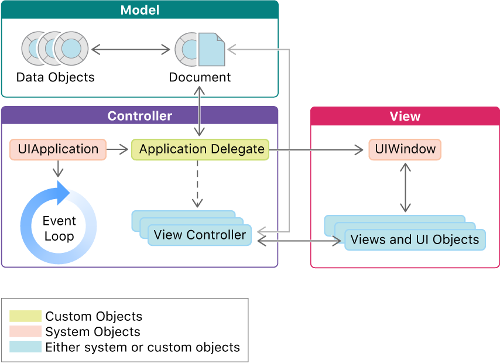

# App Development with UIKit

## What
UIKit - Construct and manage a graphical, event-driven user interface for your iOS or tvOS app.

## Why
The UIKit framework provides the core objects that you need to build apps for iOS and tvOS. You use these objects to display your content onscreen, to interact with that content, and to manage interactions with the system.

## Xcode provides template projects as starting points for every app you create.

Required Resources
- App icons
- Launch screen storyboard - app’s initial user interface

Required App Metadata
- The system derives information about your app’s configuration and capabilities from the information property list (Info.plist) file in your app bundle.
- For example, if your app relies on specific hardware, or uses specific system frameworks, you might need to add information related to those features to this file.

# Code Structure of a UIKit App
## What
UIKit provides many of your app’s core objects, including those that interact with the system, run the app’s main event loop, and display your content onscreen.
## How

The structure of UIKit apps is based on the Model-View-Controller (MVC) design pattern, wherein objects are divided by their purpose.
-  Model objects manage the app’s data and business logic.
- View objects provide the visual representation of your data.
- Controller objects act as a bridge between your model and view objects, moving data between them at appropriate times.

- UIKit defines the UIView class, which is usually responsible for displaying your content onscreen. (You can also render content directly to the screen using Metal and other system frameworks.) 
- The UIApplication object runs your app’s main event loop and manages your app’s overall life cycle.
- Application Delegate: Handle system evens

# Views and Controls
## What
Present your content onscreen and define the interactions allowed with that content.

## How
- Views can host other views.

## You can also use views to do any of the following:
- Respond to touches and other events (either directly or in coordination with gesture recognizers).

- Draw custom content using Core Graphics or UIKit classes.

- Support drag and drop interactions.

- Respond to focus changes.

- Animate the size, position, and appearance attributes of the view.

https://developer.apple.com/tutorials/swiftui/interfacing-with-uikit

https://developer.apple.com/documentation/uikit

https://developer.apple.com/documentation/uikit/mac_catalyst/uikit_catalog_creating_and_customizing_views_and_controls

https://developer.apple.com/documentation/uikit/about_app_development_with_uikit
